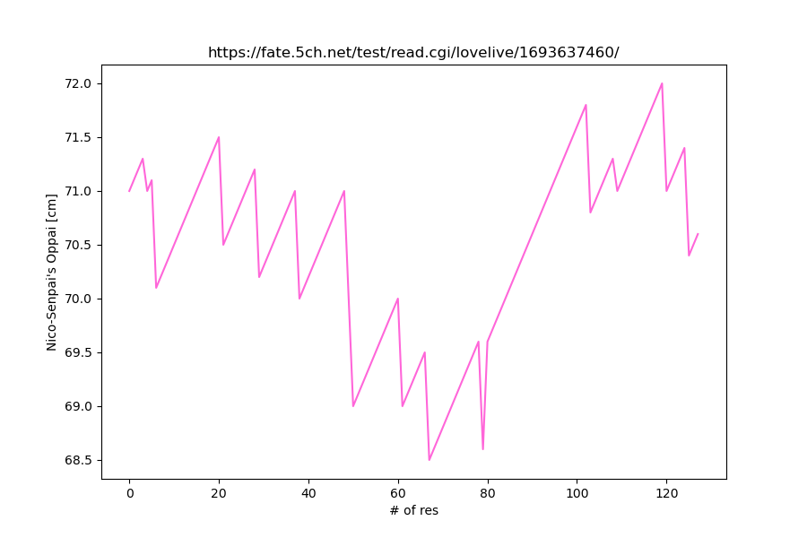
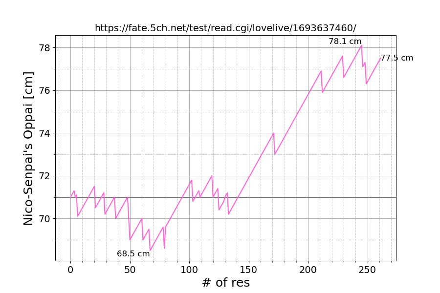

# NicoPai

从cι˘σ ᴗ σ˘*   ラ板のこのスレを Python3 で集計します

- [1レスごとに矢澤にこちゃんのおっぱいが0.1cm膨らむスレ　71.0cmからスタート](https://fate.5ch.net/test/read.cgi/lovelive/1693637460/)


## nico.py

Python に標準で入っている <code>urllib.request</code>, <code>html.parser.HTMLParser</code> を利用してスクレイピング, 集計.

Matplotlib を使うので, 無い場合はインストールしてください.

```shell
pip install --upgrade pip
pip install matplotlib
```

<!--

-->


## beautiful_nico.py

Python 標準ではない <code>requests</code>, <code>BeautifulSoup4</code> を利用してスクレイピング, 集計.

```shell
pip install requests
pip install bs4
```

