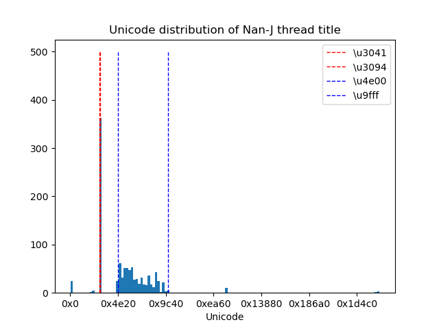
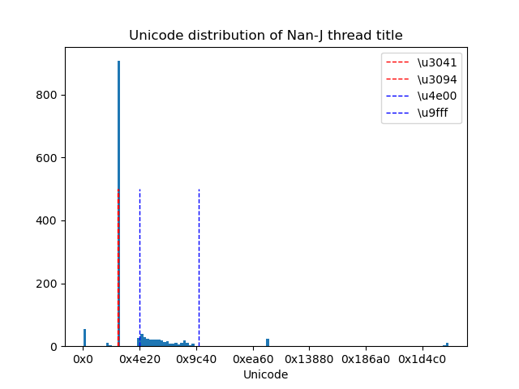

# GET_THREAD

5ch の荒らしの特徴を掴むためのスレタイスクレイピング


## Usage

requests, BeautifulSoup4, Matplotlib 等が必要


```shell
pip install --upgrade pip
pip install requests
pip install bs4
pip install matplotlib
```

特に argument を指定できる訳でもない.

```shell
python get_thread.py
```

デフォルトのままでは, [なんJ の subback.html](https://eagle.5ch.net/livejupiter/subback.html) を参照してスレタイ一覧を取得して分析する.

次のようなヒストグラムが得られるはずである.

<figure style='display: flex; gap:5px;'>


</figure>
<p style='text-align: center;'>(左): 荒されている時, (右): 平常時.</p>

とはいうものの, Unicode で histogram を描いて見ても荒しの特徴は掴みづらい.

## 結論

含まれている漢字は常用漢字で読み方の頭文字が「あ」～「し」で始まる物になっており, 平仮名は拗音や促音や濁点, 半濁点を含まない.

そこで, 該当する常用漢字を 4 回以上含むスレタイを NG にしたい場合は
以下の正規表現を NG に加えればよい.
(ただし, それ以外の文字を 1 文字でも含むスレタイは, 自動で NG から外れる)

```
^[あいうえおかきくけこさしすせそたちつてとなにぬねのはひふへほまみむめもやゆよらりるれろわをん]*([亜哀挨愛曖悪握圧扱宛嵐安案暗以衣位囲医依委威為畏胃尉異移萎偉椅彙意違維慰遺緯域育一壱逸茨芋引印因咽姻員院淫陰飲隠韻右宇羽雨唄鬱畝浦運雲永泳英映栄営詠影鋭衛易疫益液駅悦越謁閲円延沿炎怨宴媛援園煙猿遠鉛塩演縁艶汚王凹央応往押旺欧殴桜翁奥横岡屋億憶臆虞乙俺卸音恩温穏下化火加可仮何花佳価果河苛科架夏家荷華菓貨渦過嫁暇禍靴寡歌箇稼課蚊牙瓦我画芽賀雅餓介回灰会快戒改怪拐悔海界皆械絵開階塊楷解潰壊懐諧貝外劾害崖涯街慨蓋該概骸垣柿各角拡革格核殻郭覚較隔閣確獲嚇穫学岳楽額顎掛潟括活喝渇割葛滑褐轄且株釜鎌刈干刊甘汗缶完肝官冠巻看陥乾勘患貫寒喚堪換敢棺款間閑勧寛幹感漢慣管関歓監緩憾還館環簡観韓艦鑑丸含岸岩玩眼頑顔願企伎危机気岐希忌汽奇祈季紀軌既記起飢鬼帰基寄規亀喜幾揮期棋貴棄毀旗器畿輝機騎技宜偽欺義疑儀戯擬犠議菊吉喫詰却客脚逆虐九久及弓丘旧休吸朽臼求究泣急級糾宮救球給嗅窮牛去巨居拒拠挙虚許距魚御漁凶共叫狂京享供協況峡挟狭恐恭胸脅強教郷境橋矯鏡競響驚仰暁業凝曲局極玉巾斤均近金菌勤琴筋僅禁緊錦謹襟吟銀区句苦駆具惧愚空偶遇隅串屈掘窟熊繰君訓勲薫軍郡群兄刑形系径茎係型契計恵啓掲渓経蛍敬景軽傾携継詣慶憬稽憩警鶏芸迎鯨隙劇撃激桁欠穴血決結傑潔月犬件見券肩建研県倹兼剣拳軒健険圏堅検嫌献絹遣権憲賢謙鍵繭顕験懸元幻玄言弦限原現舷減源厳己戸古呼固股虎孤弧故枯個庫湖雇誇鼓錮顧五互午呉後娯悟碁語誤護口工公勾孔功巧広甲交光向后好江考行坑孝抗攻更効幸拘肯侯厚恒洪皇紅荒郊香候校耕航貢降高康控梗黄喉慌港硬絞項溝鉱構綱酵稿興衡鋼講購乞号合拷剛傲豪克告谷刻国黒穀酷獄骨駒込頃今困昆恨根婚混痕紺魂墾懇左佐沙査砂唆差詐鎖座挫才再災妻采砕宰栽彩採済祭斎細菜最裁債催塞歳載際埼在材剤財罪崎作削昨柵索策酢搾錯咲冊札刷刹拶殺察撮擦雑皿三山参桟蚕惨産傘散算酸賛残斬暫士子支止氏仕史司四市矢旨死糸至伺志私使刺始姉枝祉肢姿思指施師恣紙脂視紫詞歯嗣試詩資飼誌雌摯賜諮示字寺次耳自似児事侍治持時滋慈辞磁餌璽鹿式識軸七𠮟叱失室疾執湿嫉漆質実芝写社車舎者射捨赦斜煮遮謝邪蛇尺借酌釈爵若弱寂手主守朱取狩首殊珠酒腫種趣寿受呪授需儒樹収囚州舟秀周宗拾秋臭修袖終羞習週就衆集愁酬醜蹴襲十汁充住柔重従渋銃獣縦叔祝宿淑粛縮塾熟出述術俊春瞬旬巡盾准殉純循順準潤遵処初所書庶暑署緒諸女如助序叙徐除小升少召匠床抄肖尚招承昇松沼昭宵将消症祥称笑唱商渉章紹訟勝掌晶焼焦硝粧詔証象傷奨照詳彰障憧衝賞償礁鐘上丈冗条状乗城浄剰常情場畳蒸縄壌嬢錠譲醸色拭食植殖飾触嘱織職辱尻心申伸臣芯身辛侵信津神唇娠振浸真針深紳進森診寝慎新審震薪親人刃仁尽迅甚陣尋腎][あいうえおかきくけこさしすせそたちつてとなにぬねのはひふへほまみむめもやゆよらりるれろわをん]*){4,}$
```

なお, <code>𠮟</code> (U+20B9F), <code>叱</code> (U+53F1) は後者のみで良いが, 面倒なので両方入れている. 

(本来の常用漢字は前者の <code>𠮟</code> の方だが, 
前者 <code>𠮟</code> は JIS 第3水準, 後者 <code>叱</code> は JIS 第1水準 に登録されており, 
スクリプトで生成される文字列に含まれているのは後者.)

## todo

クラス化等.